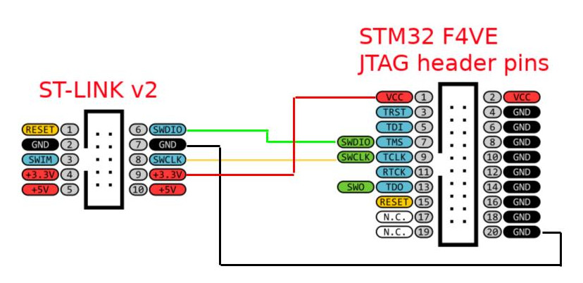
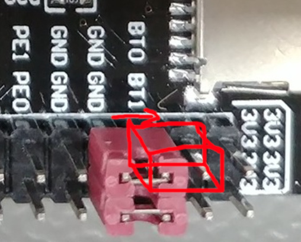

Electron ROM Emulator
=====================
A simple adaptor board to use a STM32 F4VE STM32F407VET6 based Development Board with [Kernel Crash's Electron ROM Emulator project](https://github.com/kernelcrash/electron-rom-emulator). Includes the analogue joystick port and Pi Tube Direct interface.

This repo also contains a convenient build of the tim-tube-version branch of the firmware and an example SD Card image with the folder structure, MMFS and Plus1 Utils ROMs and a loaded BEEB.MMB file to get started.

Quick Start Guide
=================

1. Take [Gerbers](pcb/Gerber_ElectronROMEmulator_PCB_ElectronROMEmulator_2024-12-04.zip) to JLCPCB/PCBWay.

2. Solder on a couple of [2x24 Female Header sockets](https://www.lcsc.com/product-detail/Female-Headers_Hong-Cheng-HC-PM254-8-5H-2x24PZ_C27985239.html) and a [50pin Edge connector](https://www.lcsc.com/product-detail/Edgeboard-Connectors_WingTAT-ED50MEBGFBK_C5242015.html). You can also add the PiTube and 15-pin joystick ports too, if your feeling fancy. I've not managed to get the Joystick port to work with current firmware and PiTube is untested with this board at present (Jan 2025).

2. Buy a cheap STM32 F4VE STM32F407VET6 based Development Board from AliExpress/eBay etc, it should look like this entry in [STM32-base](https://stm32-base.org/boards/STM32F407VET6-STM32-F4VE-V2.0.html).

3. Program the STM32 F4VE firmware, using EITHER **a ST-Link v2 Debugger** :

    1. You can get the cheap clone ST-Link v2s from  AliExpress/eBay/Amazon, then wire up the following to the J-TAG port (the 20 pin one at a right angle on the end as follows):

    

    2. Ubuntu Linux:
    ```
    sudo apt install stlink
    cd [wherever the .bin file is]
    st-flash write electron-rom-emulator.bin 0x8000000
    ```

    3. Windows
    Ummm, not sure, not tried it but probably using the STM32CubeProgrammer and selecting the ST-LINK next to the connect button and loading the [electron-rom-emulator.bin](firmware/electron-rom-emulator.bin) file and select "Start Programming" from the Erasing & Programming tab.

    4. Remove ST-Link from the board
    

4. OR **Using just a mini USB Cable**:

    1. Set BOOT0 pin to 3V3 (ie, '1') and BOOT1 to GND (ie, '0'):

    

    2. Connect the mini USB cable (you know the USB cable that came with you webcam in 2003)

    3. Press the wee RST button in the corner of the board.

    4. Start the STM32CubeProgrammer, select USB and select a DFU from the Port selector, hit connect (may need to set the PID and VID if you have a fake, see **)

    5. Load the [electron-rom-emulator.bin](firmware/electron-rom-emulator.bin) file and select "Start Programming" from the Erasing & Programming tab.

    6. Disconnect the USB cable and remove the BOOT jumpers

5. Insert the STM32 F4VE board into the adaptor board - SD-Card slot and JTag port away from the Elk

6. Get a micro SD-Card. It's recommended to use an old, smallish (1-8 GB), slow thing.

7. Write the .img file inside [quick_start_sdcard.zip](sdcard/quick_start_sdcard.zip) - Google this as I can't go into details here - I used a Disk Manager thing on my Ubunutu Laptop. This has a BEEB.MMB file on it, the MMFS and Plus1 ROMs and *some* of the folder structure used to load ROM files to sideways RAM slots. This should get you to the Gamez quick and show you all the sweet RAM on startup! See the original project page for more detials on how to set this up and use it: [Kernel Crash's Electron ROM Emulator project](https://github.com/kernelcrash/electron-rom-emulator)

8. Stick SD Card into the slot, insert the adaptor board into the Elk and power it up.

9. Should see 160K RAM at top of the screen and Shift + Break should load up the gamez: Enjoy!

** I had a fake STM32 chip on my AliExpress STM32 F4VE board, was actually a Geehy chip. And it wouldn't let me program it using the ST-Link v2. But I could programm it using DFU mode and USB cable, I just had to change the PID and VID to the ones my chip used. I found that in linux using the lsusb command, Windows users might be able to use Device Manager or something. 